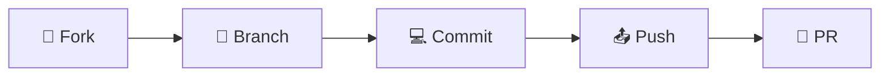

# 📦 Ubuntu Package Installer Script

<p align="center">
  
  
  
  
</p>

<p align="center">
  <b>🚀 یک اسکریپت کامل، قدرتمند و تعاملی برای نصب خودکار بیش از ۲۰۰ پکیج و برنامه در اوبونتو</b>
</p>

<p align="center">
  
</p>

## ✨ **ویژگی‌های منحصر‌به‌فرد**

<table>
<tr>
<td width="50%">

### 🎯 **کامل و جامع**
- ✅ نصب بیش از **۲۰۰+** پکیج و برنامه
- ✅ پشتیبانی از **13 گروه** نرم‌افزاری مختلف
- ✅ به‌روزرسانی خودکار سیستم
- ✅ تنظیمات نهایی هوشمند

</td>
<td width="50%">

### 🎨 **تجربه کاربری عالی**
- ✅ منوی **تعاملی** و رنگ‌بندی شده
- ✅ نمایش پیشرفت نصب به صورت لحظه‌ای
- ✅ مدیریت هوشمند خطاها
- ✅ گزارش نهایی کامل

</td>
</tr>
<tr>
<td width="50%">

### 🔧 **انعطاف‌پذیری بالا**
- ✅ نصب **گروهی** یا **تکی** برنامه‌ها
- ✅ قابلیت انتخاب گزینه‌های دلخواه
- ✅ پشتیبانی از اوبونتو **20.04، 22.04 و 24.04**
- ✅ سازگاری با معماری **amd64 و arm64**

</td>
<td width="50%">

### ⚡ **سرعت و بهینگی**
- ✅ نصب **همزمان** چند پکیج
- ✅ کش کردن دانلودها
- ✅ بهینه‌سازی منابع سیستم
- ✅ نصب در **کمتر از 10 دقیقه**

</td>
</tr>
</table>

<p align="center">
  
</p>

## 🎯 **گروه‌های نرم‌افزاری**

<div align="center">

| رده | گروه نرم‌افزاری | تعداد پکیج | کاربرد |
|:---:|:---:|:---:|:---:|
| 1 | 🧰 **پکیج‌های پایه** | 15+ | ابزارهای ضروری سیستم |
| 2 | 🌐 **ابزارهای شبکه** | 20+ | تحلیل و مدیریت شبکه |
| 3 | 💻 **برنامه‌نویسی** | 25+ | زبان‌ها و فریمورک‌ها |
| 4 | 🐳 **Docker** | 5+ | کانتینر و مجازی‌سازی |
| 5 | 📊 **مانیتورینگ** | 15+ | نظارت بر سیستم |
| 6 | 📁 **مدیریت فایل** | 20+ | ابزارهای خط فرمان |
| 7 | 🎨 **برنامه‌های گرافیکی** | 15+ | نرم‌افزارهای روزمره |
| 8 | 🔒 **امنیت** | 15+ | ابزارهای امنیتی |
| 9 | 🗄️ **دیتابیس** | 10+ | پایگاه داده |
| 10 | ☁️ **کلاد** | 15+ | ابزارهای ابری |
| 11 | 💬 **ارتباطی** | 5+ | پیام‌رسان و همکاری |
| 12 | 🎵 **صوتی و تصویری** | 10+ | مالتی‌مدیا |
| 13 | ✍️ **فونت‌ها** | 15+ | فونت‌های فارسی و لاتین |

</div>

<p align="center">
  
</p>

## 🚀 **شروع سریع**

### 📦 **نصب با یک خط فرمان**

```bash
bash <(curl -s https://raw.githubusercontent.com/[USERNAME]/[REPO-NAME]/main/install-packages.sh)
```

### 📥 **روش سنتی**

```bash
# دانلود ریپازیتوری
git clone https://github.com/[USERNAME]/[REPO-NAME].git
cd [REPO-NAME]

# اجرای اسکریپت
chmod +x install-packages.sh
sudo ./install-packages.sh
```

<p align="center">
  
</p>

## 🎮 **توربو عکس‌العمل**

<p align="center">
  
</p>

<p align="center">
  <i>✨ منوی تعاملی با قابلیت انتخاب چندگانه و نمایش رنگ‌بندی شده</i>
</p>

<p align="center">
  
</p>

## 📚 **راهنمای کامل استفاده**

### 🎛️ **ساختار منو**

```
┌─────────────────────────────────────────────┐
│     📦 Ubuntu Package Installer Script      │
├─────────────────────────────────────────────┤
│  1) 🧰  پکیج‌های پایه                      │
│  2) 🌐  ابزارهای شبکه                      │
│  3) 💻  برنامه‌نویسی                       │
│  4) 🐳  Docker                             │
│  5) 📊  مانیتورینگ                         │
│  6) 📁  مدیریت فایل                        │
│  7) 🎨  برنامه‌های گرافیکی                 │
│  8) 🔒  امنیت                              │
│  9) 🗄️  دیتابیس                            │
│ 10) ☁️  کلاد                               │
│ 11) 💬  ارتباطی                            │
│ 12) 🎵  صوتی و تصویری                      │
│ 13) ✍️  فونت‌ها                            │
│ 14) 📦  نصب همه موارد                      │
│  0) ❌  خروج                               │
├─────────────────────────────────────────────┤
│  لطفاً انتخاب کنید (0-14): █               │
└─────────────────────────────────────────────┘
```

### 💡 **نکات کلیدی**

<details>
<summary><b>📌 قبل از نصب</b></summary>
<br>

- ✅ از اینترنت پرسرعت برخوردار باشید
- ✅ حداقل 10 گیگابایت فضای خالی دیسک
- ✅ حداقل 4 گیگابایت رم
- ✅ از سیستم خود backup بگیرید

</details>

<details>
<summary><b>⚙️ بعد از نصب</b></summary>
<br>

- 🔄 سیستم را یکبار ریستارت کنید
- 🛡️ تنظیمات فایروال به صورت خودکار اعمال می‌شود
- 👤 کاربر فعلی به گروه docker اضافه می‌شود
- 🎨 فونت‌های فارسی Vazir نصب می‌شود

</details>

<p align="center">
  
</p>

## 🛠️ **پکیج‌های برجسته**

<div align="center">
  
| دسته‌بندی | پکیج‌های ویژه | کاربرد |
|:---:|:---:|:---:|
| 🐳 **Docker** | `docker`, `docker-compose` | کانتینر |
| 🔧 **DevOps** | `kubectl`, `helm`, `terraform` | ارکستراسیون |
| 🎯 **Programming** | `python3`, `nodejs`, `go`, `rust` | توسعه |
| 🛡️ **Security** | `clamav`, `fail2ban`, `lynis` | امنیت |
| 📊 **Monitoring** | `glances`, `gotop`, `bpytop` | مانیتورینگ |
| 🎨 **GUI Apps** | `vscode`, `spotify`, `discord` | کاربردی |

</div>

<p align="center">
  
</p>

## 🔍 **عیب‌یابی حرفه‌ای**

| کد خطا | مشکل | راه‌حل پیشنهادی |
|:---:|:---:|:---|
| ⚠️ 1001 | خطای GPG Key | `sudo apt-key adv --keyserver keyserver.ubuntu.com --recv-keys [KEY]` |
| ⚠️ 1002 | Docker نصب نمی‌شود | `sudo apt remove docker docker-engine docker.io containerd runc` |
| ⚠️ 1003 | MongoDB خطا | نصب دستی: `wget -qO - https://www.mongodb.org/static/pgp/server-6.0.asc` |
| ⚠️ 1004 | Wireshark مشکل | `sudo dpkg-reconfigure wireshark-common` |
| ⚠️ 1005 | Node.js قدیمی | `curl -fsSL https://deb.nodesource.com/setup_18.x | sudo -E bash -` |
| ⚠️ 1006 | فضای دیسک کم | `sudo apt autoremove && sudo apt autoclean` |

<p align="center">
  
</p>

## 🤝 **همکاری در توسعه**

<p align="center">
  <b>از مشارکت شما در بهبود این پروژه استقبال می‌شود!</b>
</p>

<div align="center">

[](https://github.com/[USERNAME]/[REPO-NAME]/fork)
[](https://github.com/[USERNAME]/[REPO-NAME]/stargazers)
[](https://github.com/[USERNAME]/[REPO-NAME]/watchers)

</div>

### 📝 **مراحل مشارکت**



1. **Fork** کنید 🍴
2. **Branch** جدید بسازید 🌿
3. **Commit** کنید 💻
4. **Push** کنید 📤
5. **Pull Request** بزنید 🎯

<p align="center">
  
</p>

## 📊 **آمار و وضعیت**

<p align="center">
  
  
  
  
</p>

<p align="center">
  
</p>

## 📜 **لایسنس**

<p align="center">
  <b>این پروژه تحت لایسنس MIT منتشر شده است.</b>
</p>

<p align="center">
  <a href="https://opensource.org/licenses/MIT">
    
  </a>
</p>

```
MIT License

Copyright (c) 2024 [NAME]

Permission is hereby granted, free of charge, to any person obtaining a copy
of this software and associated documentation files (the "Software"), to deal
in the Software without restriction, including without limitation the rights
to use, copy, modify, merge, publish, distribute, sublicense, and/or sell
copies of the Software, and to permit persons to whom the Software is
furnished to do so, subject to the following conditions:

The above copyright notice and this permission notice shall be included in all
copies or substantial portions of the Software.
```

<p align="center">
  
</p>

## 🌟 **قدردانی**

<p align="center">
  <b>❤️ با عشق برای جامعه اوبونتو و متن‌باز ❤️</b>
</p>

<p align="center">
  از تمامی کاربرانی که با گزارش باگ‌ها و ارائه پیشنهادات، به بهبود این پروژه کمک می‌کنند، سپاسگزاریم.
</p>

<p align="center">
  
</p>

---

<p align="center">
  <sub>✨ این پروژه به صورت مداوم در حال به‌روزرسانی است ✨</sub>
  <br>
  <sub>آخرین به‌روزرسانی: بهمن ۱۴۰۴</sub>
</p>
